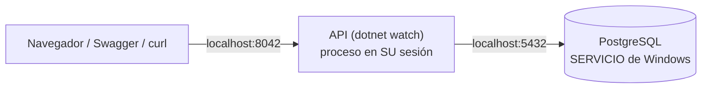

# El entorno local (edición sin Docker)

> Qué corre dónde en esta edición, y cómo se administra. El gemelo con
> Docker resuelve todo esto con contenedores; aquí lo resuelven el
> **servicio de PostgreSQL** y el **SDK de .NET**.

## 1. Las dos piezas y quién las enciende

| Pieza | Quién la enciende | Cómo se apaga |
|---|---|---|
| **PostgreSQL** (la BD) | Windows, solo, al arrancar la máquina (es un servicio: `services.msc` → `postgresql-x64-<versión>`) | No hace falta apagarlo; si quiere: desde `services.msc` |
| **La API** (`api_facturas`) | Usted: `dotnet watch run` en la carpeta `api_facturas` | `Ctrl+C` en esa terminal |



**Guía de lectura:** a diferencia del gemelo con Docker (donde API y BD se
hablan por la red interna con hostnames), aquí TODO es `localhost`: la API
es un proceso suyo y la BD un servicio de la máquina.

## 2. Dónde viven los datos

En la carpeta `data` de la instalación
(`C:\Program Files\PostgreSQL\<versión>\data`). Sobreviven a reinicios,
a `git pull` y a borrar el clon: **la BD no vive en la carpeta del
proyecto** — exactamente la misma lección del volumen de Docker.

## 3. Usuarios y bases de datos del curso

| Qué | Valor |
|---|---|
| Superusuario (solo para `crear_bd.ps1` y pgAdmin) | `postgres` / `postgres` |
| Usuario del curso (el que usa la API) | `construccion` / `Construccion123!` |
| La BD del repo | `bdfacturas_postgres_local` |
| La BD de SU reconstrucción | la que usted cree: `.\db\crear_bd.ps1 -NombreBd bdfacturas_mi_v1` |

La API nunca se conecta como `postgres`: usa el usuario del curso con
permisos sobre SU base — la misma higiene que en producción.

## 4. Operaciones frecuentes

```powershell
# Ver que la BD responde (psql vive en C:\Program Files\PostgreSQL\<v>\bin):
& "C:\Program Files\PostgreSQL\17\bin\psql.exe" -h localhost -U construccion -d bdfacturas_postgres_local -c "SELECT count(*) FROM producto"

# RESET a los datos originales (⚠️ borra los suyos):
& "C:\Program Files\PostgreSQL\17\bin\psql.exe" -h localhost -U postgres -d postgres -c "DROP DATABASE bdfacturas_postgres_local"
.\db\crear_bd.ps1
```

(También todo con clics en **pgAdmin 4**, que se instaló junto a
PostgreSQL.)

## 5. Si algo falla

| Síntoma | Causa probable |
|---|---|
| `crear_bd.ps1` dice "PostgreSQL no responde" | El servicio está detenido (`services.msc`) o la clave del superusuario no es `postgres` (edite `PGPASSWORD` en el script) |
| La API responde 500 "connection refused" | El servicio de PostgreSQL está caído, o la BD no existe aún (corra `crear_bd.ps1`) |
| `dotnet watch run` no encuentra el SDK | Instale el SDK de .NET 10 y reabra la terminal |
| Tildes dañadas en los datos | Corrió el `.sql` a mano sin UTF-8: resetee con `crear_bd.ps1` (él fija `PGCLIENTENCODING`) |
| El puerto 8042 está ocupado | Otra API del curso corre; ciérrela, o cambie el puerto en `Properties/launchSettings.json` |
